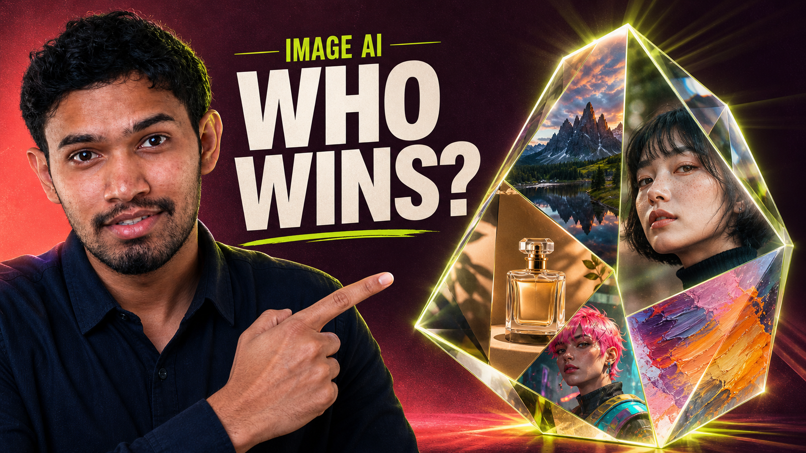

# Awesome AI Image Models 

> The most complete, up-to-date comparison of AI image generation models — **which model, via which API, at what price, and what it's best at.**

Unlike other lists that just dump links, this one answers the question developers actually have: *"I need to generate images — which model do I pick, and where do I call it?"* Every model is mapped to the APIs that serve it, with real per-image pricing and what it's genuinely good for.

> 💡 Prices are per **standard image** (retail API rates verified Aug 2026) and move fast — always confirm against the provider. 4K/high-res and batch modes change the math (batch often ~50% off).

  

  <a href="https://www.youtube.com/watch?v=SI1KJ2prGmc"><b>📺 Best AI Image Generator (API) in 2026 (Quality, Price, Uncensored, Editing) →</b></a>

## Related Projects

- [awesome-uncensored-ai-image-models](https://github.com/Anil-matcha/awesome-uncensored-ai-image-models) — Filtering-, access-, and licensing-focused companion catalog for local and hosted image model variants
- [MuAPI AI Image API](https://muapi.ai/ai-image-api) — the ranked leaderboard from the video above, live and ready to call
- [MuAPI image playground](https://muapi.ai/playground) — Run the image models compared in this list through one API.
- [MuAPI model docs](https://muapi.ai/docs/models) — Browse model IDs and supported capabilities.
- [midjourney-api](https://github.com/Anil-matcha/midjourney-api) — Python SDK for Midjourney V7, V8, and Niji generation through MuAPI.
- [awesome-ai-video-models](https://github.com/Anil-matcha/awesome-ai-video-models) — sister list: compare AI **video** models by API, price & speed
- [Open-Generative-AI](https://github.com/Anil-matcha/Open-Generative-AI) — curated hub of open generative-media tools and pipelines
- [Awesome-GPT-Image-2-API-Prompts](https://github.com/Anil-matcha/Awesome-GPT-Image-2-API-Prompts) — prompt library for GPT Image
- [nano-banana-generator](https://github.com/SamurAIGPT/nano-banana-generator) — generate with Google Nano Banana
- [ai-headshot-generator](https://github.com/SamurAIGPT/ai-headshot-generator) — AI headshots pipeline
- [Generative-Media-Skills](https://github.com/SamurAIGPT/Generative-Media-Skills) — runtime for generative-media prompts
- [ai-creator-academy](https://github.com/Anil-matcha/ai-creator-academy) — free curriculum teaching creators how to monetize the models compared in this list
- [Flux-3-Dev-API](https://github.com/Anil-matcha/Flux-3-Dev-API) — Python wrapper for Black Forest Labs' FLUX 3 (Dev variant) — text-to-image, image-to-image, text-to-video, image-to-video
- [Grok-Imagine-Image-2-API](https://github.com/Anil-matcha/Grok-Imagine-Image-2-API) — Python SDK and MCP server for Grok Imagine Image 2.0 text-to-image and multi-reference editing through MuAPI
- [awesome-flux-3-api-prompts](https://github.com/Anil-matcha/awesome-flux-3-api-prompts) — FLUX 3 API guide, prompts, and parameters
- [LoRA-Trainer-API](https://github.com/Anil-matcha/LoRA-Trainer-API) — compare Muapi LoRA training endpoints for custom image adapters.
- [Image-Enhancement-API](https://github.com/Anil-matcha/Image-Enhancement-API) — compare Muapi image upscaling and background-removal APIs.

## Contents

- [Commercial models (closed, API-only)](#commercial-models-closed-api-only)
- [Best value](#best-value)
- [Best uncensored / unrestricted](#best-uncensored--unrestricted)
- [Open-source models (self-host or API)](#open-source-models-self-host-or-api)
- [Image editing & control](#image-editing--control)
- [Character consistency](#character-consistency)
- [Frameworks & UIs](#frameworks--uis)
- [Upscaling & restoration](#upscaling--restoration)
- [Benchmarks & leaderboards](#benchmarks--leaderboards)
- [How to choose](#how-to-choose)
- [Where to run them (API providers)](#where-to-run-them-api-providers)
- [Contributing](#contributing)

## Commercial models (closed, API-only)

| Model | Maker | Best for | APIs | Price / image | Notes |
|-------|-------|----------|------|---------------|-------|
| **GPT Image 2** | OpenAI | 🏆 Best overall quality | OpenAI API, MuAPI | ~$0.09 | Tops Artificial Analysis's Text-to-Image Arena (Elo 1370); 2K res, clean multilingual text rendering; edit mode ranks #3 on the Editing Arena |
| **Nano Banana Pro** | Google | 4K, editing, character consistency | Gemini API, Fal, Replicate, MuAPI | ~$0.12 | Community/press favorite for photorealism; best-in-class coherent local edits and locking character identity across generations |
| **Seedream 5.0 Pro** | ByteDance | Stylized/artistic output | Fal, Replicate, MuAPI | ~$0.045 | Strongest stylized output of the set — "wins on capability boundaries" per independent comparisons |
| **Midjourney v8** | Midjourney | Aesthetic / artistic, `--cref` character consistency | MuAPI | ~$0.10 | Still the aesthetic-quality benchmark; API access via MuAPI, no official first-party API |
| **Imagen 4 Ultra** | Google | Photorealism, prompt adherence | Gemini / Vertex AI, MuAPI | ~$0.06 | Google's top tier |
| **Ideogram Character** | Ideogram | In-image text, character reference | Ideogram API, Fal, Replicate, MuAPI | ~$0.15 | Best photorealistic character consistency in side-by-side comparisons |
| **Recraft V3** | Recraft | Design, vector, brand | Fal, Replicate | ~$0.04 | SVG/vector + style control |

## Best value

| Model | Maker | License | Price / image | Notes |
|-------|-------|---------|---------------|-------|
| **Z-Image Turbo** | Alibaba (Tongyi-MAI) | Apache-2.0 | ~$0.007 | Cited across 2026 roundups as the price/quality sweet spot, not just the cheapest option — also the #1 open-weights model on Artificial Analysis's Text-to-Image Arena |
| **Flux-2 Klein 4B Turbo** | Black Forest Labs | Commercial (BFL license) | ~$0.0052 | Half the price of the standard Klein 4B, same Flux-family quality |
| **FLUX.1 [schnell]** | Black Forest Labs | Apache-2.0 | ~$0.003 | Near-instant generation, the classic low-cost workhorse, free commercial use |
| **SDXL** | Stability AI | Community License | ~$0.004 | The fallback when you just need pixels at the lowest possible cost |

## Best uncensored / unrestricted

⚠️ No mainstream model ships a muapi-branded "Spicy" *image* endpoint (unlike its video counterparts) — these are picks with minimal/no built-in content filtering in practice, not a specifically labeled unrestricted tier.

| Model | Maker | Price / image | Notes |
|-------|-------|---------------|-------|
| **Wan 2.7** | Alibaba | ~$0.05 | Widely cited in 2026 uncensored/NSFW-generation roundups for near-zero prompt filtering |
| **Qwen Image 2.0** | Alibaba | ~$0.04 | 2026 coverage explicitly tests and confirms NSFW capability, no prompt-rewriting layer in the way |
| **Seedream 5.0** | ByteDance | ~$0.0325 | Grouped with Wan/Qwen in "open pipeline, no surprise censorship" comparisons |
| **Grok Imagine** | xAI | ~$0.05 | Marketed with a looser content policy than mainstream Western closed models |

See the companion [awesome-uncensored-ai-image-models](https://github.com/Anil-matcha/awesome-uncensored-ai-image-models) for a deeper filtering/licensing-focused catalog.

## Open-source models (self-host or API)

| Model | Maker | License | Best for | APIs | Self-host VRAM |
|-------|-------|---------|----------|------|----------------|
| **Z-Image Turbo** | Alibaba (Tongyi-MAI) | Apache-2.0 | 🏆 #1 open-weights model on Artificial Analysis's Text-to-Image Arena, ahead of FLUX.2 [dev], HunyuanImage 3.0, and Qwen-Image | Fal, Replicate, MuAPI | ~12GB+ |
| **Qwen-Image** | Alibaba | Apache-2.0 | Best in-image text (EN/CN) | Fal, Replicate, MuAPI | ~24GB+ (20B) |
| **FLUX.2 [dev]** | Black Forest Labs | Non-commercial (paid license for commercial) | Top OSS quality, 4MP — the model Z-Image Turbo is benchmarked against | Fal, Replicate, MuAPI | ~24GB+ |
| **HiDream i1 (Full)** | HiDream | MIT | Genuinely different architecture from Flux/Qwen/Z-Image families | MuAPI | ~24GB+ |
| **HunyuanImage 3.0** | Tencent | Open (check terms) | Largest OSS model (80B MoE) | self-host | ~40GB+ |
| **Stable Diffusion 3.5 Large** | Stability AI | Community License (free <$1M rev) | Ecosystem, LoRAs, ControlNet | Fal, Replicate, self-host | ~18GB+ |
| **SANA** | NVIDIA | Permissive research | Fast, efficient, low-VRAM | self-host | ~12GB |

## Image editing & control

Modify existing images rather than generate from scratch:

| Model | Maker | Best for | Price / generation | Notes |
|-------|-------|----------|--------------------|-------|
| **Nano Banana Pro Edit** | Google | 🏆 Best editing | ~$0.12 | Leads on coherent object insertion/removal, repaints edits into the scene rather than visibly patching |
| **GPT Image 2 (edit mode)** | OpenAI | Arena-verified editing | ~$0.09 | Ranks #3 on Artificial Analysis's own Image Editing Arena (Elo 1257) |
| **Seedream 5.0 Edit** | ByteDance | High-volume editing | ~$0.0325 | 1/4 to 1/7 the cost of Nano Banana Pro Edit |
| **FLUX.1 Kontext Pro** | Black Forest Labs | Instruction-based editing | ~$0.03 | Pioneered one-sentence instruction editing, no fine-tuning needed |
| **Qwen Image Edit 2511** | Alibaba | Open-model editing | ~$0.04 | Industry-leading performance for its price tier |

Also supported natively across the models above: **ControlNet** (structural conditioning — pose, depth, edges, scribble), **IP-Adapter** (image prompting / style + subject transfer), and inpainting/outpainting.

## Character consistency

Keep the same subject's identity locked across multiple generations, not just a one-off crop-and-paste:

| Model | Maker | Price / generation | Notes |
|-------|-------|--------------------|-------|
| **Nano Banana Pro** | Google | ~$0.12 | Reputation for locking character identity across edits/scenes |
| **Ideogram Character** | Ideogram | ~$0.15 | Dedicated Character Reference feature, best photorealistic consistency in side-by-side comparisons |
| **Midjourney v8** (`--cref`) | Midjourney | ~$0.10 | Strongest option for stylized/artistic recurring characters |
| **MiniMax Subject Reference** | MiniMax | ~$0.01 | Cheapest dedicated subject-consistency endpoint |
| **Vidu Q2 Reference-to-Image** | Vidu | ~$0.032 | Reference-driven generation |

## Frameworks & UIs

For local generation, training, and workflows:

- **[ComfyUI](https://github.com/comfyanonymous/ComfyUI)** — node-based, most powerful for custom pipelines
- **[AUTOMATIC1111 WebUI](https://github.com/AUTOMATIC1111/stable-diffusion-webui)** — the classic all-in-one UI
- **[InvokeAI](https://github.com/invoke-ai/InvokeAI)** — polished pro/creative UI
- **[Fooocus](https://github.com/lllyasviel/Fooocus)** — simplest "just works" UI
- **Training:** kohya_ss, OneTrainer, SimpleTuner (LoRA / fine-tuning)

## Upscaling & restoration

- **Real-ESRGAN** — general-purpose upscaling (open source)
- **GFPGAN / CodeFormer** — face restoration
- **chaiNNer** — node-based batch processing
- **Topaz Photo AI** — highest-quality commercial upscale/denoise

## Benchmarks & leaderboards

Check independent evals before trusting a maker's demo gallery:

- **Artificial Analysis Image Arena** (Text-to-Image + Image Editing) — Elo-style human-preference leaderboards
- **HEIM** (Holistic Evaluation of Image Models) — multi-dimension benchmark
- **FID / CLIP Score / ImageReward** — automated quality & alignment metrics

## How to choose

- **Best overall quality** → GPT Image 2 (Arena #1), or Nano Banana Pro for photorealism/local edits
- **Best value** → Z-Image Turbo (~$0.007/image, also the #1 open-weights model)
- **Best uncensored / unrestricted** → Wan 2.7 or Qwen Image 2.0 (no prompt-rewriting layer in practice)
- **Best editing** → Nano Banana Pro Edit, or GPT Image 2 (edit mode) for an arena-verified pick
- **Best character consistency** → Nano Banana Pro or Ideogram Character (dedicated Character Reference)
- **Fully open, commercial-safe** → FLUX.1 [schnell] or Qwen-Image (both permissive); Z-Image Turbo for the current open-weights quality leader
- **Design / vector / brand** → Recraft V3
- **Ecosystem & LoRAs** → Stable Diffusion 3.5

## Where to run them (API providers)

Aggregators that expose many of the above behind one API/key:

- **[MuAPI](https://muapi.ai)** — unified API across image + video models (GPT Image 2, Nano Banana Pro, Seedream, FLUX, Z-Image, Qwen, and more), one key, one billing — see the full [AI Image API leaderboard](https://muapi.ai/ai-image-api)
- **[Fal](https://fal.ai)** — fast inference, broad model catalog
- **[Replicate](https://replicate.com)** — pay-per-run, large community model catalog

Native APIs (single-vendor): OpenAI (GPT Image), Google Gemini/Vertex (Nano Banana, Imagen), Black Forest Labs (FLUX), Ideogram, Recraft.

## Contributing

PRs welcome. When adding a model, keep the table columns filled — **a row without provider + price isn't useful.** New models go in the correct table (commercial vs open-source vs task-specific) and stay sorted by relevance.

---

*Maintained alongside [awesome-ai-video-models](https://github.com/Anil-matcha/awesome-ai-video-models) and [Open-Generative-AI](https://github.com/Anil-matcha/Open-Generative-AI). Found it useful? ⭐ the repo.*
